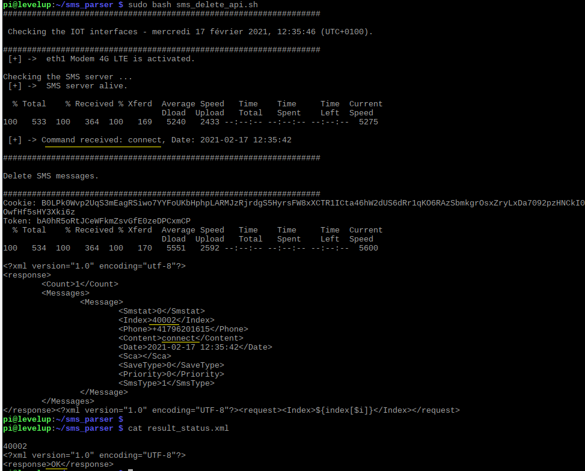
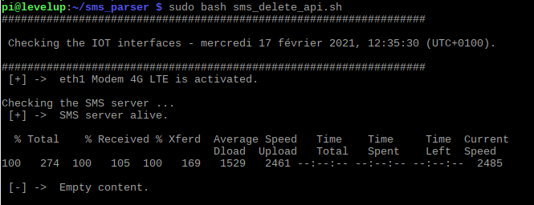

# SMS parser

The HUAWEI Modem E3372 offers an API in XML format that could be used to send, read, and delete SMS messages.
Using this API, we have written an SMS messages' parser to control remotely our devices.
connect, disconnect, update, upload, etc 

## Reading and deleting a SMS message 

## Empty SMS 

## License

[DRINKOTEC](https://drinkotec.ch/)
